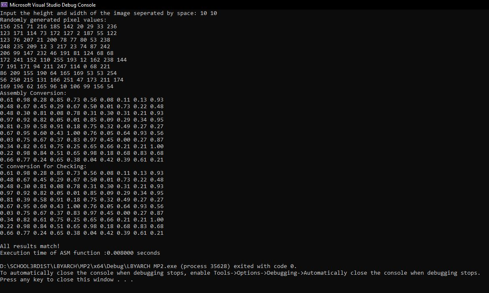
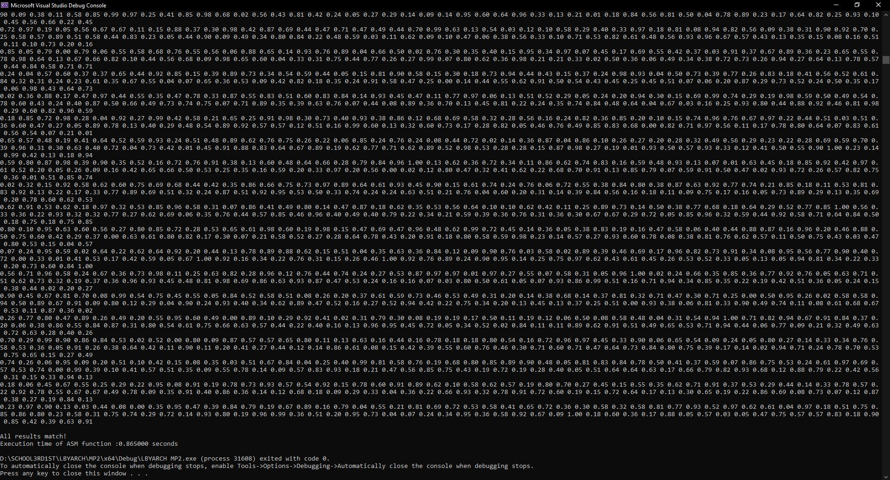
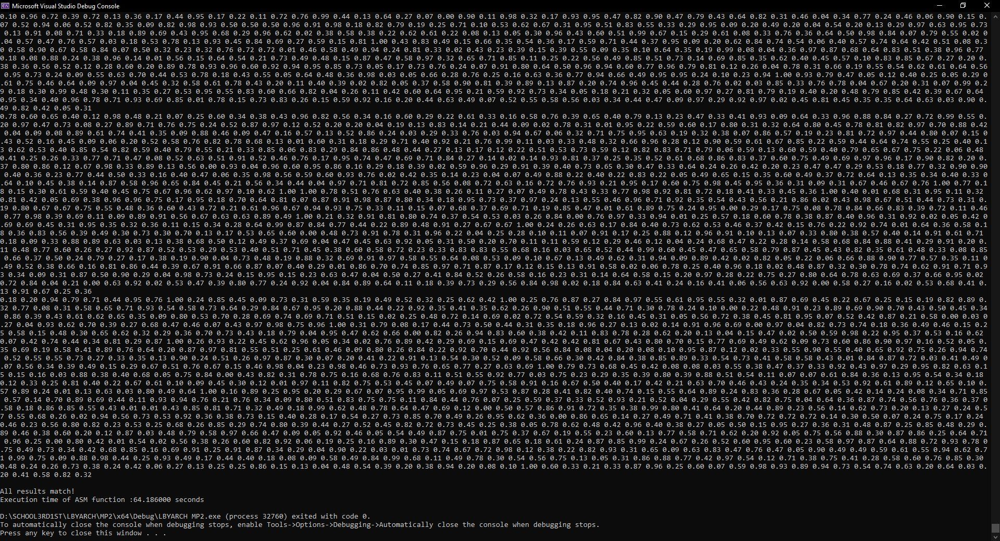

# MP2
MADE BY:
Baniqued, Lourenz Jhay G. And
De Guzman, Joaquin Nicholas C.

## Overview
The program is written in **C** and **x86-64 Assembly**, with functionality to process pixel values and convert them using Assembly Function.

---

## Execution Time and Performance Analysis

The execution time of the Assembly Function was measured for 10 * 10, 100 * 100, 1000 * 1000. The test is run 30 times to get the average execution time. Below are the results for the ASM function:

| Method          | Average Execution Time (seconds) |
|-----------------|--------------------------|
| 10*10 | 0.008033333333       |
|  100*100  | 0.5066    |
|  1000*1000  | 33.36216667    |

Below are the results for the C function:
| Method          | Average Execution Time (seconds) |
|-----------------|--------------------------|
| 10*10 | 0.01006666667       |
|  100*100  | 0.4885    |
|  1000*1000  | 33.29783333    |

Link of tests: https://docs.google.com/spreadsheets/d/1iV-V2P77U_uW7-nzBrkqMWuYemiLZkOcvrB35FCf-VA/edit?usp=sharing

### Analysis:

---

## Program Output and Correctness Check
### 10 * 10

### 100 * 100

### 1000 * 1000

---

## Short Videos

---
[Demo Video](https://drive.google.com/file/d/1GLSPLI_hfYSpWvvjMgyHeOSh72mTszT2/view?usp=sharing)
